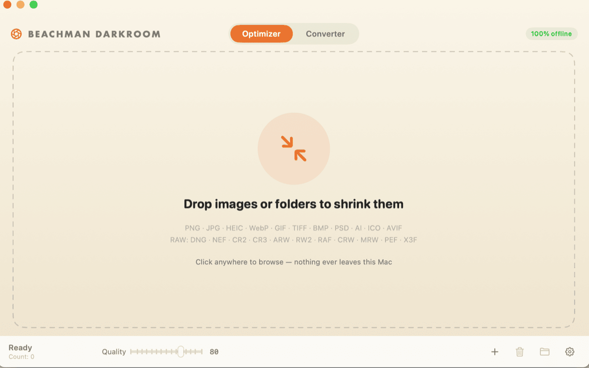

<div align="center">

# Beachman Darkroom

**A free, offline image compressor for macOS — built to be driven by Claude.**

Ask Claude to make your images smaller. Or drag them into the app. Either way it runs
entirely on your Mac: nothing uploads, nothing phones home, and it works with the wifi off.



</div>

---

## Ask Claude to do it

The reason this exists. Install the included [Claude Code](https://claude.com/claude-code)
skill and just ask:

> *"compress the photos on my desktop"*
> *"make these product shots web-ready"*
> *"convert this folder to WebP"*

```bash
cp -R skill/compress-images ~/.claude/skills/
```

Claude figures out the rest — which files, lossy or lossless, what quality — and reports
what actually changed. The skill teaches it when lossless beats lossy, to check exit
codes, and to warn you before replacing originals it can't get back. It also tells Claude
not to fall back to a web compressor, which is rather the point of a local tool.

Everything below is for when you'd rather do it yourself.

## What it does

**Optimizer** — shrink files in place, or alongside as `name-min.ext`.

| Format | Engine | Typical |
|---|---|---|
| PNG | pngquant (quantization + dithering) → oxipng (deflate re-squeeze) | −60–80% |
| JPEG | mozjpeg (trellis quantization, progressive) | −50–80% |
| WebP | cwebp | −25% |
| GIF | gifsicle `-O3` | varies |
| HEIC / TIFF | ImageIO re-encode | varies |

Never writes a file that came out bigger — if there's no gain, the original is left
alone. Strips EXIF and GPS as a side effect. A lossless mode skips pixel re-encoding
entirely, for logos and line art where quantization can band flat colour.

**Converter** — reads PNG, JPG, HEIC/HEIF, WebP, GIF, TIFF, BMP, PSD, AI, ICO, AVIF and
camera RAW (DNG, NEF, CR2, CR3, ARW, RW2, RAF, CRW, MRW, PEF, X3F). Writes PNG, JPG,
JPEG, TIFF, HEIC, HEIF, WebP, BMP, PDF. Picks a background colour when flattening
transparency into a format without an alpha channel.

Real numbers from the test set:

```
2.4 MB PNG  →  584 KB   (−75%)   pngquant + oxipng
5.9 MB JPG  →  1.2 MB   (−80%)   mozjpeg q80
2.1 MB PNG  →  112 KB   (−95%)   converted to WebP
```

The screenshot at the top of this README was compressed by the app itself: 504 KB → 46 KB.

## Install

Download the installer zip from the [latest release](../../releases/latest), unzip, and
double-click **Install.command**. It sets up three things:

- the app in `/Applications` (quarantine flag cleared, so it opens on first double-click)
- the `darkroom` CLI on your `PATH`
- a **Compress with Darkroom** right-click menu in Finder

Requires **macOS 13+ on Apple Silicon** — the bundled engines are arm64 builds.

### Or build it — no security prompt this way

```bash
brew install pngquant oxipng webp gifsicle mozjpeg
git clone https://github.com/TheBeachman/beachman-darkroom.git
cd beachman-darkroom && ./packaging/build.sh
```

Takes about a minute, and needs Xcode Command Line Tools. Output lands in `dist/`; run
`dist/Install.command` to place it, or just drag the app to `/Applications`.

Worth knowing: **an app you build yourself opens with no security warning.** macOS
quarantines files that arrive from a browser, not ones compiled on the machine, so
Gatekeeper never gets involved. The downloaded release is ad-hoc signed and would
otherwise prompt on first launch — `Install.command` clears that for you — but building
locally sidesteps it entirely. If you have Claude Code, ask it to do the build.

Under the hood the build copies each engine and its transitive dylib closure into the
bundle and rewrites the load paths to `@rpath`, so the finished `.app` runs on Macs
without Homebrew.

The Finder menu can also be installed on its own, at any time:

```bash
./packaging/install-quick-action.sh
```

## Command line

The app is also a CLI. Same engines, no window.

```bash
darkroom optimize --quality 80 ~/Desktop/photos      # folders walked recursively
darkroom optimize --lossless logo.png                # never re-encode pixels
darkroom optimize --suffix photo.jpg                 # keep the original
darkroom convert --format webp --quality 80 shots/
darkroom convert --format jpg --bg "#FFFFFF" logo.png
```

| Option | |
|---|---|
| `--quality 1-100` | Target quality, default 80 |
| `--lossless` | Optimize only, never re-encode pixels |
| `--suffix` | Write `name-min.ext` instead of replacing the original |
| `--format <fmt>` | png, jpg, jpeg, tiff, heic, heif, webp, bmp, pdf |
| `--bg "#RRGGBB"` | Background when flattening alpha into jpg/bmp/pdf |
| `--json` | Machine-readable output — structured before/after bytes, percentages, engine used, and per-file errors |

Exit codes: `0` all succeeded · `1` one or more failed · `64` usage error.

## How it works

A small SwiftUI front end over battle-tested command-line compressors. Decoding and
non-specialised encoding go through Apple's ImageIO, which is what gives us PSD, ICO,
AVIF and RAW for free; PDF and AI input is rasterised with PDFKit. The specialised work
is handed to the engines below, run as subprocesses.

There's no clever new algorithm here, and that's deliberate — the open-source
implementations of this problem are already excellent. What's added is that they're
wrapped in something anyone can use, they ship as one bundle with nothing to install,
and your images never leave the machine.

## Third-party engines

| | License |
|---|---|
| [pngquant / libimagequant](https://pngquant.org) | GPL v3 |
| [oxipng](https://github.com/oxipng/oxipng) | MIT |
| [mozjpeg](https://github.com/mozilla/mozjpeg) | BSD-3 / IJG / zlib |
| [libwebp](https://chromium.googlesource.com/webm/libwebp) | BSD-3 |
| [gifsicle](https://github.com/kohler/gifsicle) | GPL v2 |

Full notices in [THIRD-PARTY-NOTICES.md](THIRD-PARTY-NOTICES.md).

## License

GPL v3 — see [LICENSE](LICENSE). Darkroom distributes pngquant and gifsicle binaries in
its app bundle, so the combined work is licensed to match. Practically: use it, fork it,
change it, ship it — keep it open.

---

<div align="center">
<sub>Built at <a href="https://beachman.ca">Beachman Motor Company</a>, Toronto.</sub>
</div>
